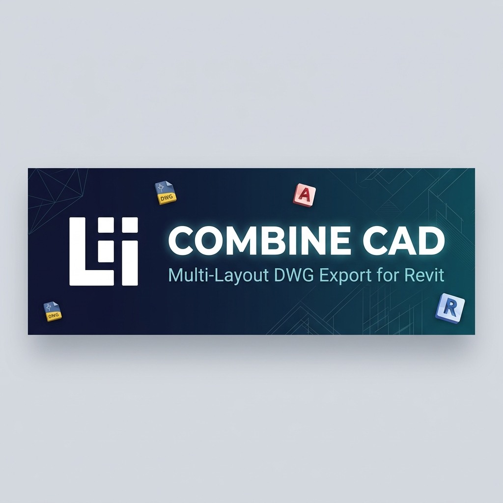
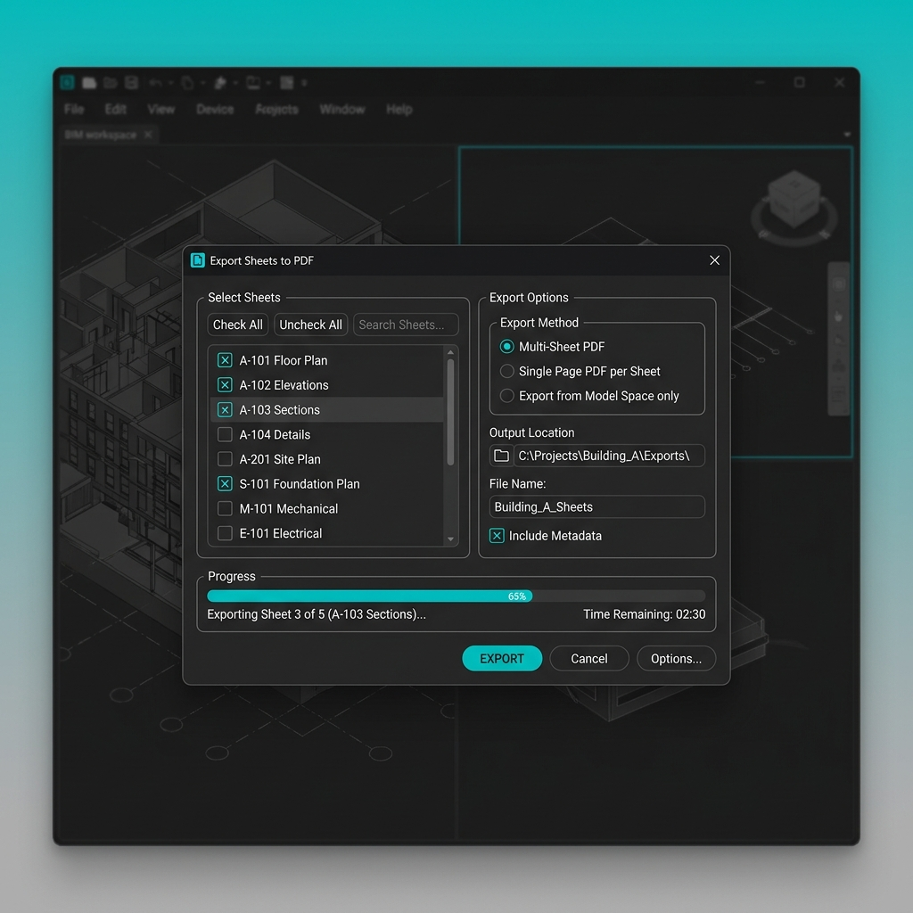
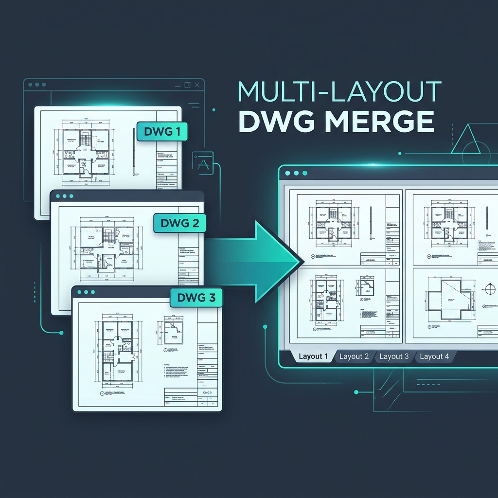

<p align="center">
  
</p>

<p align="center">
  <strong>🔗 Multi-Layout DWG Export & Merge for Revit</strong>
</p>

<p align="center">
  <a href="https://github.com/licorp/Licorp-CombineCAD/releases/latest">
    
  </a>
  <a href="https://github.com/licorp/Licorp-CombineCAD/releases">
    
  </a>
  
  
  
</p>

<p align="center">
  <sub>Export Revit sheets sang DWG và tự động merge thành file multi-layout — kết hợp sức mạnh Revit + AutoCAD</sub>
</p>

---

## 📋 Mục lục

- ✨ [Features](#-features)
- 🖼️ [Screenshots](#️-screenshots)
- 📦 [Installation](#-installation)
- 🚀 [Quick Start](#-quick-start)
- 🏗️ [Architecture](#️-architecture)
- ⚙️ [Configuration](#️-configuration)
- 🔧 [Build from Source](#-build-from-source)
- 📝 [Changelog](#-changelog)

---

## ✨ Features

<table>
<tr>
<td width="50%" valign="top">

### 🔀 Multi-Layout Merge

- Export sheets → **merge thành 1 file** DWG
- Mỗi sheet = **1 layout tab** riêng biệt
- Giữ nguyên **viewport**, title block, annotations
- Tự động đồng bộ **ModelSpace offsets**
- Powered by **AcCoreConsole** (headless AutoCAD)

</td>
<td width="50%" valign="top">

### 📄 Flexible Export Modes

- **Individual**: Mỗi sheet → 1 file DWG riêng
- **Multi-Layout**: Gộp → 1 file, nhiều layout tabs
- **Single Layout**: Gộp → 1 file, 1 layout duy nhất
- **Model Space**: Xếp sheets grid trong Model Space
- Chọn **DWG Export Setup** từ document

</td>
</tr>
<tr>
<td width="50%" valign="top">

### 🔗 Smart XREF Handling

- **Auto-Bind XRefs** — tự động nhúng linked files
- Xử lý linked models: **unload → export → reload**
- Cleanup XREF files sau export
- Không còn file `.dwg` rác trong thư mục output

</td>
<td width="50%" valign="top">

### 📐 Smart View Scale

- Phát hiện **primary viewport scale** tự động
- Update title block parameter với **actual scale**
- Hỗ trợ nhiều viewport trên cùng 1 sheet
- Mapping scale → text hiển thị (1:100, 1:50, ...)

</td>
</tr>
<tr>
<td width="50%" valign="top">

### 🗂️ Layer Manager

- **Export/Import** DWG layer mapping settings
- Chia sẻ settings cho cả **team** qua file `.txt`
- Đọc từ Revit **DWG Export Setup**
- Consistent layer standards across projects

</td>
<td width="50%" valign="top">

### 💾 Profile System

- Lưu **tất cả settings** giữa các session
- Nhớ output folder, export mode, options
- **Per-project** hoặc global preferences
- Startup nhanh — không cần config lại

</td>
</tr>
</table>

---

## 🖼️ Screenshots

<p align="center">
  
</p>
<p align="center">
  <sub><em>Export Dialog — Chọn sheets, cấu hình export mode, và bắt đầu merge</em></sub>
</p>

<br>

<p align="center">
  
</p>
<p align="center">
  <sub><em>Multi-Layout Merge — Nhiều sheets → 1 file DWG với nhiều layout tabs</em></sub>
</p>

---

## 📦 Installation

### 🖥️ Installer (Khuyến nghị)

Tải file cài đặt từ [**Releases**](https://github.com/licorp/Licorp-CombineCAD/releases/latest):

| File | Kích thước | Mô tả |
|------|-----------|-------|
| `Licorp_CombineCAD_Setup_1.0.0.exe` | ~2.7 MB | Installer tự động cho Revit 2020-2027 + AutoCAD plugin |

> **Installer sẽ tự động:**
> - Cài Revit add-in cho **tất cả versions** (2020-2027)
> - Cài AutoCAD plugin `Licorp_MergeSheets.bundle`
> - Đăng ký `.addin` manifest files
> - Hỗ trợ **uninstall** sạch sẽ qua Windows Settings

### 🔧 Manual Install

<details>
<summary>Xem hướng dẫn cài đặt thủ công</summary>

1. Build solution:
   ```powershell
   .\build-package.bat
   ```

2. Copy Revit add-in files:
   ```
   bin\R2025\Release\Licorp_CombineCAD.dll    → %APPDATA%\Autodesk\REVIT\Addins\2025\
   bin\R2025\Release\Licorp_CombineCAD.addin   → %APPDATA%\Autodesk\REVIT\Addins\2025\
   ```

3. Copy AutoCAD merge plugin:
   ```
   src.acad\Licorp_MergeSheets\  → %PROGRAMDATA%\Autodesk\ApplicationPlugins\Licorp_MergeSheets.bundle\
   ```

</details>

---

## 🚀 Quick Start

```
1️⃣  Mở Revit → load project có sheets
2️⃣  Tab "Licorp" → Panel "Combine CAD"
3️⃣  Chọn export mode (Multi-Layout recommended)
4️⃣  Tick sheets cần export
5️⃣  Chọn output folder → Click "Export"
6️⃣  Done! File DWG merged sẵn sàng 🎉
```

### Export Modes

| Mode | Mô tả | Yêu cầu AutoCAD |
|------|--------|:---:|
| 📄 **Individual** | Mỗi sheet → 1 file DWG | ❌ |
| 🔀 **Multi-Layout** | Gộp thành 1 file, mỗi sheet = 1 layout | ✅ |
| 📋 **Single Layout** | Gộp thành 1 file, 1 layout duy nhất | ✅ |
| 📐 **Model Space** | Sheets xếp grid trong Model Space | ✅ |

### Options

| Option | Mô tả |
|--------|--------|
| 🔗 Auto-Bind XRefs | Nhúng linked files, xóa XREF rác |
| 📐 Smart View Scale | Tự động cập nhật scale title block |
| 📂 Open after export | Mở file kết quả trong AutoCAD |
| 📌 Progress on top | Giữ progress dialog luôn hiển thị |

---

## 🏗️ Architecture

```
Licorp_CombineCAD/
├── src/
│   ├── Licorp_CombineCAD.Shared/          # 🔧 Shared codebase (core logic)
│   │   ├── Commands/                       #     Revit ExternalCommand entries
│   │   ├── Helpers/                        #     Reflection & utility helpers
│   │   ├── Models/                         #     Data models (SheetItem, Profile)
│   │   ├── Services/                       #     Business logic layer
│   │   │   ├── DwgExportService.cs         #     Core DWG export engine
│   │   │   ├── DwgMergeService.cs          #     AcCoreConsole merge coordinator
│   │   │   ├── DwgCleanupService.cs        #     XREF detection & cleanup
│   │   │   ├── AutoCadLocatorService.cs    #     Find AutoCAD installations
│   │   │   ├── SmartScaleService.cs        #     Viewport scale detection
│   │   │   ├── LayerMappingService.cs      #     Layer settings import/export
│   │   │   ├── ProfileService.cs           #     User preferences persistence
│   │   │   └── SheetCollectorService.cs    #     Sheet collection & analysis
│   │   ├── ViewModels/                     #     MVVM ViewModels
│   │   └── Views/                          #     WPF dialogs (dark theme)
│   ├── Licorp_CombineCAD.R2020/            # 🎯 .NET Framework 4.8 (Revit 2020-2024)
│   ├── Licorp_CombineCAD.R2025/            # 🎯 .NET 8.0 (Revit 2025-2027)
│   └── Licorp_CombineCAD.R20XX/            #     Per-version target projects
├── src.acad/
│   └── Licorp_MergeSheets/                 # 🔗 AutoCAD plugin (layout merger)
│       ├── LayoutMerger.cs                 #     Core merge logic
│       └── PackageContents.xml             #     AutoCAD bundle manifest
├── installer/
│   └── Licorp_CombineCAD.iss              # 📦 Inno Setup installer script
├── docs/images/                            # 🖼️ Documentation assets
├── build-package.bat                       # 🔨 Build + package automation
└── build-package.ps1                       # 🔨 PowerShell build script
```

### Service Layer

| Service | Chức năng |
|---------|-----------|
| `DwgExportService` | Core DWG export với linked model handling |
| `DwgMergeService` | Điều phối AutoCAD merge qua AcCoreConsole |
| `DwgCleanupService` | Phát hiện & cleanup XREF files |
| `AutoCadLocatorService` | Tìm AutoCAD/AcCoreConsole trên hệ thống |
| `SmartScaleService` | Detect & apply view scales → title blocks |
| `LayerMappingService` | Export/Import layer mapping settings |
| `ProfileService` | Lưu/load user preferences |
| `SheetCollectorService` | Thu thập sheets với viewport analysis |

### Design Patterns

- **MVVM** — ViewModels ↔ Views qua data binding
- **Service Layer** — Business logic tách biệt khỏi UI
- **Multi-targeting** — .NET Framework 4.8 + .NET 8.0
- **Shared Project** — Code dùng chung cho tất cả Revit versions

---

## ⚙️ Configuration

### System Requirements

| Component | Yêu cầu |
|-----------|---------|
| **Revit** | 2020, 2021, 2022, 2023, 2024, 2025, 2026, 2027 |
| **AutoCAD** | 2020-2027 *(chỉ cần cho merge features)* |
| **OS** | Windows 10/11 (64-bit) |
| **.NET** | Framework 4.8 *(Revit ≤2024)* / .NET 8.0 *(Revit ≥2025)* |

### Edge Cases Handled

| Tình huống | Xử lý |
|-----------|--------|
| AutoCAD không cài | Chỉ enable Individual export |
| User cancel | Cleanup temp files tự động |
| Sheet không có viewport | Skip + warning log |
| File đã tồn tại | Auto-rename với counter |
| Output folder không tồn tại | Tạo tự động |
| Export lỗi | Log error, tiếp tục sheets còn lại |
| Linked models | Unload → export → reload tự động |

---

## 🔧 Build from Source

### Prerequisites

- Visual Studio 2022+
- .NET Framework 4.8 SDK
- .NET 8.0 SDK
- Revit SDK (matching target version)

### Build

```powershell
# Build tất cả targets
.\build-package.bat

# Output
# ├── bin\R2020\Release\    — Revit 2020 add-in
# ├── bin\R2025\Release\    — Revit 2025 add-in
# ├── bin\acad\Release\     — AutoCAD plugin
# └── artifacts\            — Packaged installer
```

### Package Installer

```powershell
# Build + create Inno Setup installer
.\build-package.ps1
# Output: artifacts\release\1.0.0\installer\Licorp_CombineCAD_Setup_1.0.0.exe
```

---

## 📝 Changelog

### v1.0.0 — Initial Release

- ✅ Multi-Layout DWG merge (Revit → AutoCAD)
- ✅ Individual, Single Layout, Model Space export modes
- ✅ Auto-Bind XRefs với cleanup
- ✅ Smart View Scale detection
- ✅ Layer Manager (export/import settings)
- ✅ Dark theme WPF UI
- ✅ Support Revit 2020-2027
- ✅ Inno Setup installer
- ✅ AcCoreConsole integration (headless merge)

---

<p align="center">
  
</p>

<p align="center">
  <strong>Licorp</strong> — Engineering Productivity Tools
</p>

<p align="center">
  <sub>
    <a href="https://github.com/licorp/Licorp-CombineCAD">CombineCAD</a> •
    <a href="https://github.com/licorp/Licorp_ExportPlus">Export+</a>
  </sub>
</p>

<p align="center">
  <sub>Copyright © 2026 Licorp. All rights reserved.</sub>
</p>

<p align="center">
  <sub>
    Built with ❤️ using
    <a href="https://github.com/Nice3point">Nice3point</a> •
    <a href="https://github.com/ricaun-io">ricaun</a> •
    <a href="https://github.com/chuongmep">chuongmep</a>
  </sub>
</p>